# Creating Synthetic Power Distribution Networks from Road Network Infrastructure
## Motivation
Physical inter-dependencies between networked civil infrastructures such as transportation and power system network are well known. In order to analyze complex non-linear co-relations between such networks, datasets pertaining to such real infrastructures are required. Such data are not readily available due to their sensitive nature. The aim of this project is to generate realistic synthetic distribution network for a given geographical region. The generated network is not the actual distribution system but is very similar to the real distribution network. The synthetic network connects high voltage substations to individual residential consumers through primary and secondary distribution networks. The distribution network is generated by solving an optimization problem which minimizes the overall length of network and is subject to the usual structural and power flow constraints. The network generation algorithm is applied to create synthetic distribution networks in Montgomery county of south-west Virginia, USA.
## Datasets used
**Roads** The road network represented in the form of a graph $\mathcal{R}=(\mathcal{V}_\mathcal{R},\mathcal{L}_\mathcal{R})$, where $\mathcal{V}_\mathcal{R}$ and $\mathcal{L}_\mathcal{R}$ are respectively the sets of nodes and links of the network. Each road link $l\in\mathcal{L}_\mathcal{R}$ is represented as an unordered pair of terminal nodes $(u,v)$ with $u,v\in\mathcal{V}_\mathcal{R}$. Each road node has a spatial embedding in form of longitude and latitude. Therefore each node $v\in\mathcal{V}_\mathcal{R}$ can be represented in two dimensional space as $\mathbf{p_v}\in\mathbb{R}^2$. Similarly, a road link $l=(u,v)$ can be represented as a vector $\mathbf{p_u}-\mathbf{p_v}$.
	
**Substations** The set of substations $\mathsf{S}=\{s_1,s_2,\cdots,s_M\}$, where the area consists of $M$ substations and their respective geographical location data. Each substation can be represented by a point in the 2-D space as $\mathbf{p_s}\in\mathbb{R}^2$.
	
**Residences** The set of residential buildings with geographical coordinates $\mathsf{H}=\{h_1,h_2,\cdots,h_N\}$, where the area consists of $N$ home locations. Each residential building can be represented by a point in the 2-D space as $\mathbf{p_h}\in\mathbb{R}^2$.

## Map points in region to network links
This is accomplished using a QD-Tree approach. The primary aim is to reduce the computation time of the entire process. We provide an example to show how the algorithm works. We consider a single residential coordinate and a subset of road links as input data for our example. Our goal is to evaluate the nearest link to this point. We perform the task in four steps which are showed in the following figure.
1. Plot all the road links and the residential point of interest.
2. Draw bounding boxes around each road link and also the residential point.
3. Find the intersections of bounding box of road links with that of residential point.
4. Compute the nearest link among these short-listed links.

Step 0 | Step 1 | Step 2 | Step 3
:---: | :---: | :---: | :---:
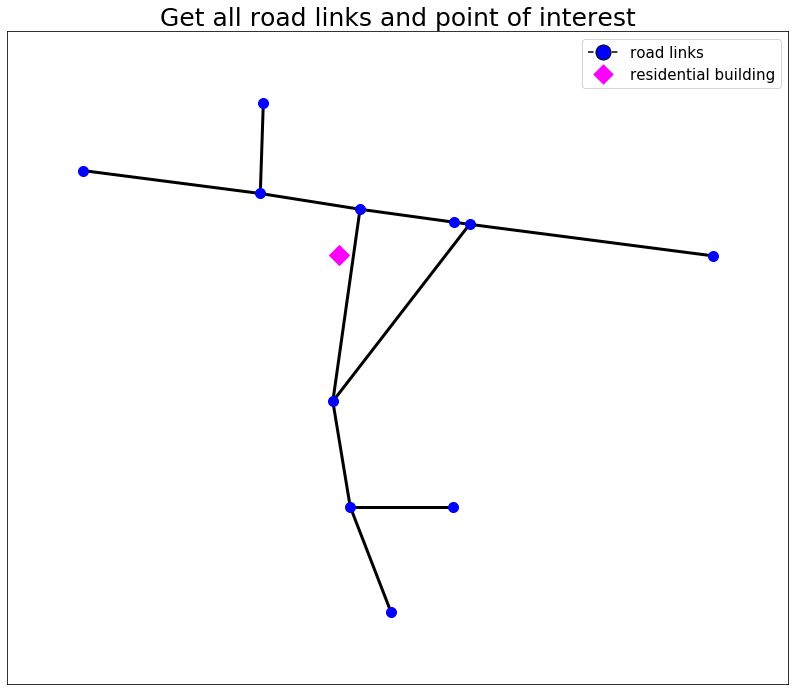 | 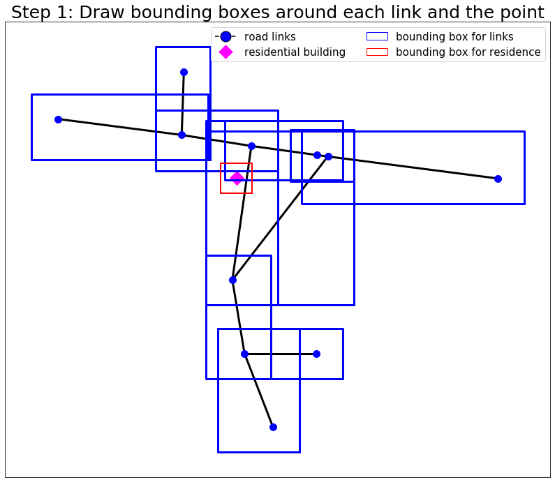 | 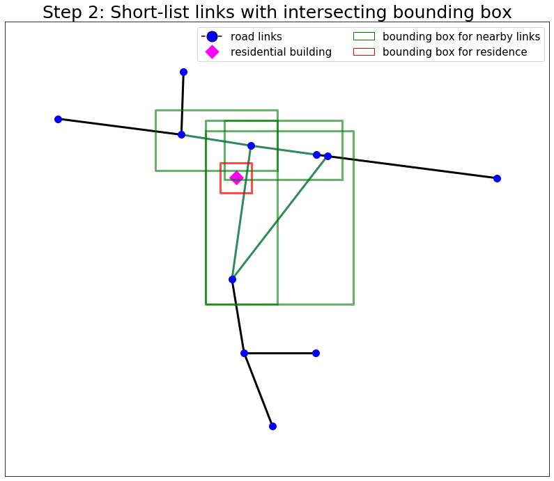 | 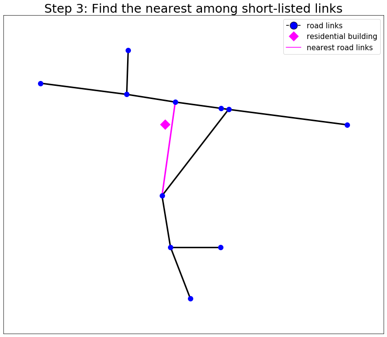
## Creating the secondary distribution network
Once the home coordinates are mapped to the nearest road network link, the next objective is to create the secondary distribution network which connects the residence coordinates with points on the road link. The first step is to interpolate points along the road network link where local transformers can be placed. An usual engineering practice undertaken by most distribution companies is to place these local transformers at equal distance apart from each other along the link. Let this distance be denoted by $\mathsf{d}$. The following aspects act as constraints while creating the secondary distribution network.
1. Each residential node has to be covered.
2. The transformer nodes can only be root nodes for the network.
3. Each residential node can either have a degree of 1 (leaf node) or 2 (non-leaf node).
4. The maximum number of hops from a transformer node (root node) is $h$.
5. The power balance constraint at every node should be maintained (commodity flow model).
6. There should not be any loops in the network. This is ensured by 
	- the flow constraint since all residences have positive loads and 
	- considering total number of edges to be equal to the number of residences which are also non-root nodes.
The above constraints are formulated as linear constraints in a mixed integer linear programming (MILP) problem. The objective function of the problem is the total length of all edges in the network. 

Mapped Residences | Local Transformers | Secondary Network
:---: | :---: | :---:
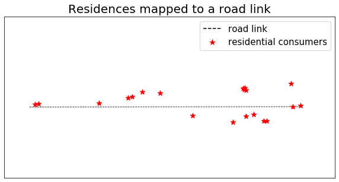 | 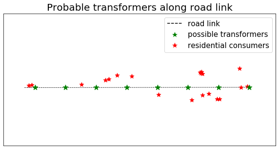 | 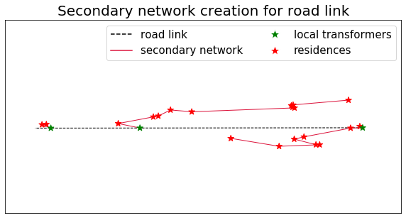

## Creating the primary distribution network
The goal is to create the primary distribution network which connects the substations to the local transformers. For this purpose, we aggregate the load at residences to the local transformer locations which have been obtained as an output from the preceding step. The objective of the current step is to connect all these local transformer locations to the substation.

We assume that the primary distribution network almost follows the road network and therefore the latter may be used as a proxy network for the former. Hence, the goal of the current step is to select edges along the road network graph such that all local transformer locations along road links are covered. The road network nodes which define the road network graph can be considered to be dummy points with no load, while the transformer locations have aggregated residential load demands. The road network nodes are only required to be covered in order to connect the local transformer points. In other words, the road network nodes cannot be leaf nodes in the created primary network.

Finally, a substation can have multiple feeder lines connecting different local group of residences. This is usual in a rural geographic region where such local groups are distinctly observable. Therefore, the primary network may be created as a forest of trees with the roots connected to the substation though high voltage feeder lines. The trees are rooted at some road network node and covers all the local transformers.
Road network | Primary Network | Entire Network
:---: | :---: | :---:
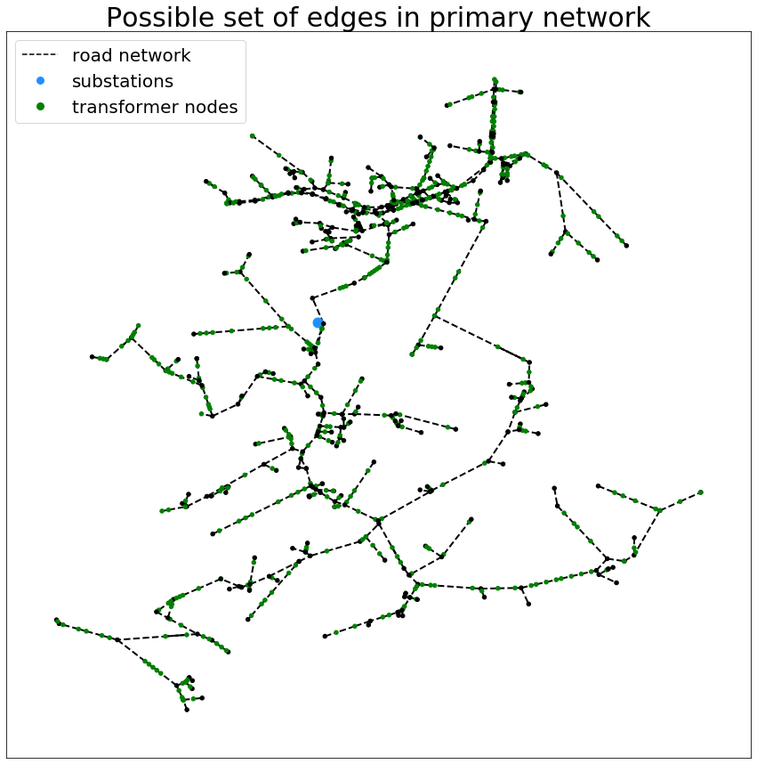 | 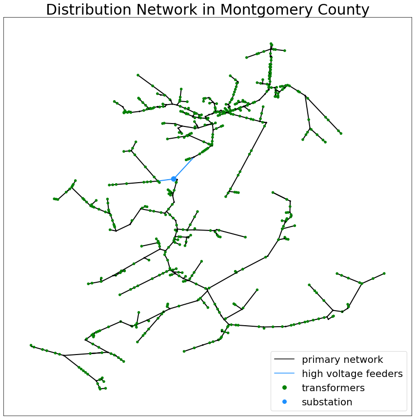 | 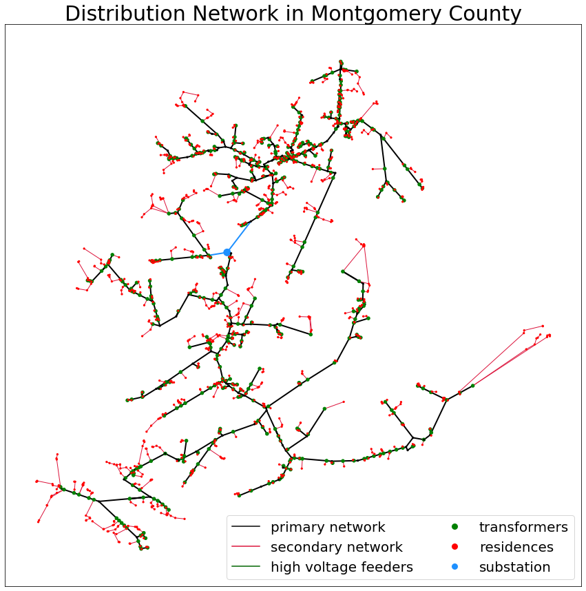

## Validating the created synthetic networks
### Operational Validation
Node Voltages | Edge power flows
:---: | :---:
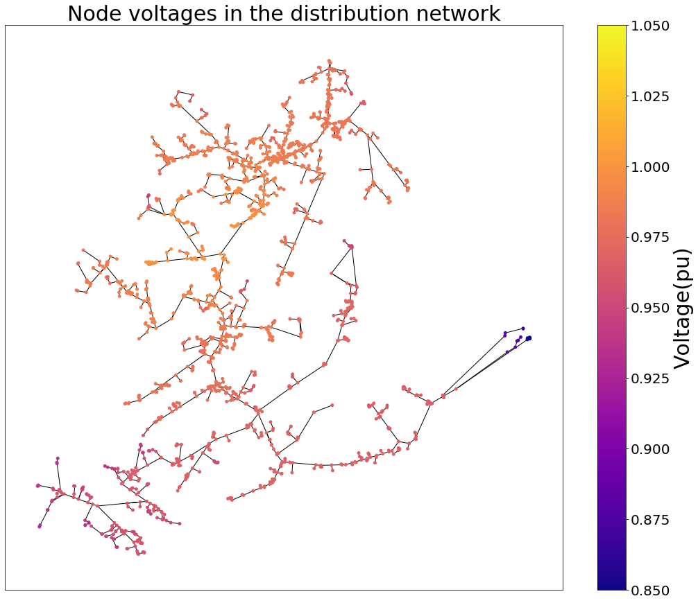 | 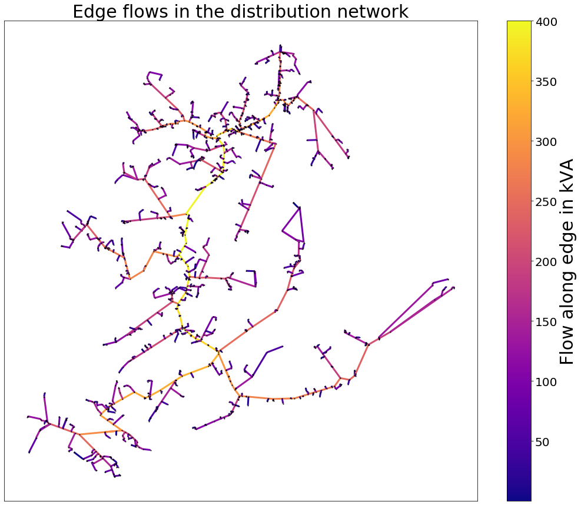

### Structural Validation
Degree Distribution | Hop Distribution
:---: | :---:
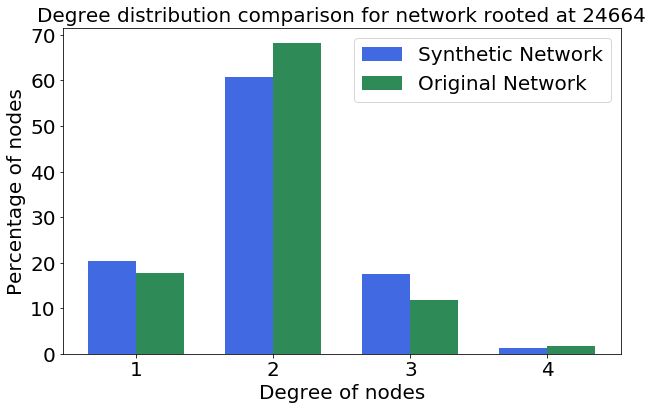 | 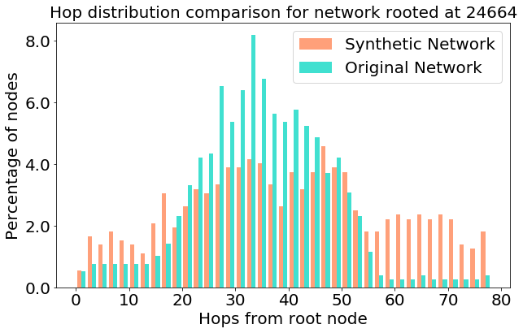

### Power Flow throughout the day
Node Voltages | Edge power flows
:---: | :---:
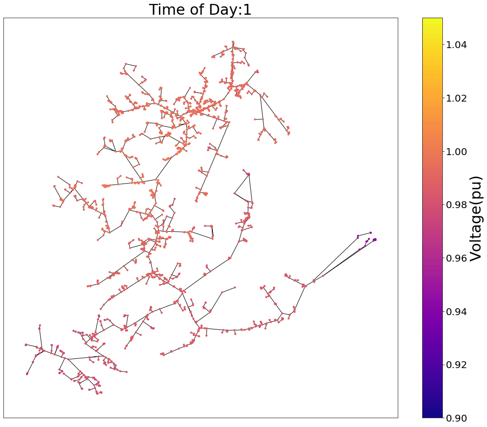 | 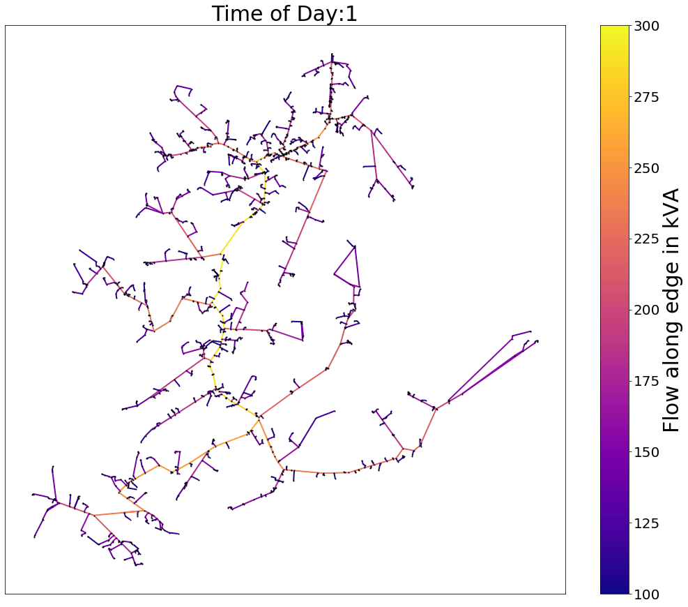

## Generating ensemble of synthetic networks 
Cumulative Hop Distribution | Kernel Density Estimates
:---: | :---:
 | 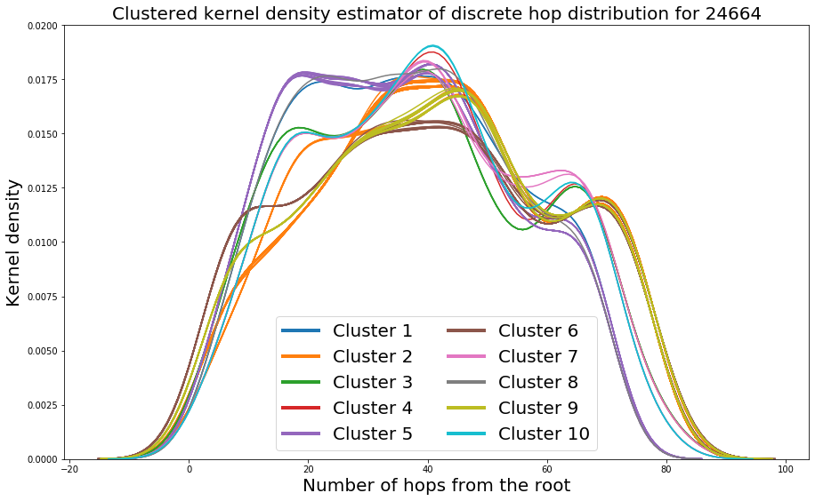
