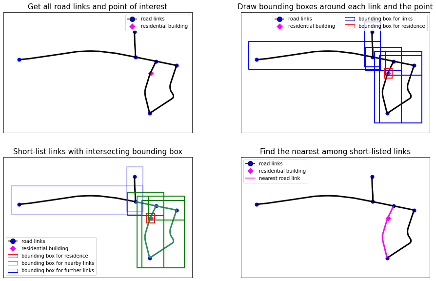
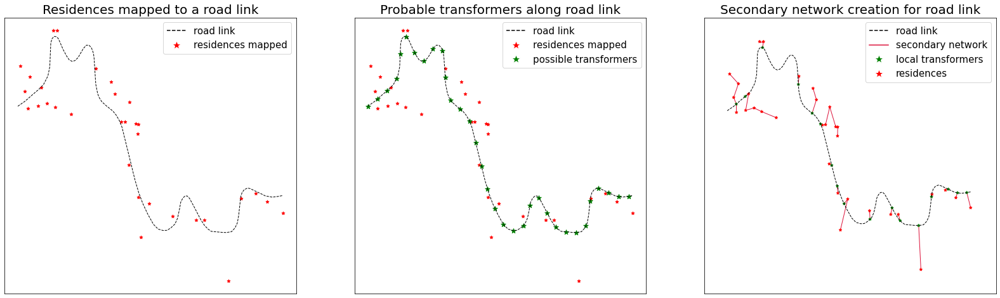
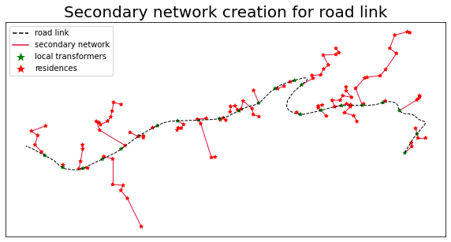
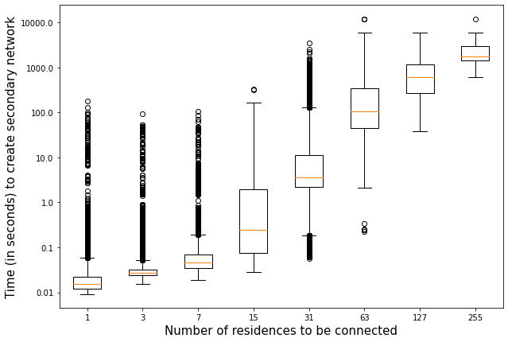

## Mapping Residences to Nearest Road Link
First, we draw bounding regions around each road link and residence point. This is done such that any point in the region is within a radius $r$ from any internal point of the road network link $l$. The bounding region for link $l=(u,v)$ is
$$\mathbf{B_l}=\big\{\mathbf{p}\big|||\mathbf{p}-\mathbf{p_l}||_2\leq r,\forall \mathbf{p_l}=\theta\mathbf{p_u}+(1-\theta)\mathbf{p_v},\theta\in[0,1]\big\}\label{eq:bound-link}$$
Similarly, a bounding region is considered for a residential building $h\in\mathsf{H}$
$$\mathbf{B_h}=\big\{\mathbf{p}\big|||\mathbf{p}-\mathbf{p_h}||_2\leq r\big\}\label{eq:bound-point}$$
The intersections between the bounding region of the building/residence and those for the links are stored and indexed in a *quad-tree* data structure. This information is retrieved to identify the links (green links in the figure) which are comparably nearer to the residential building than the others. Now, the geodesic distance of point $\mathbf{p_h}$ can be computed from these short-listed links and the nearest link can be identified henceforth. This approach reduces the computational burden of evaluating the distance between all road links and residential buildings.

## Secondary Network Generation
The secondary network connecting residences along a road network link is shown in the following figure. The first figure shows the residences (red) mapped to the road link and the probable transformers (green points) along the link. A Delaunay triangulation is considered to connect the points and obtain the set of possible edges. Thereafter, the optimization problem is solved which identifies the optimal set of edges as shown in the bottom figure. We observe that all residences are connected in star-like trees with roots as one of the transformers along the road link. 

## Computational Complexity 
We generate synthetic distribution network for the entire state of Virginia by solving two MILP optimization problems. There are $134$ counties and independent cities and residence and road network information is extracted for each of them individually. We discuss about the factors affecting the computational speed of the generation procedure. For the secondary network generation, we observe that the time to create the connection between the residences and local transformers increases exponentially with the number of residences to be connected. The box plot shows significant level of variation for same range of residences. This is due to the pattern in which they are distributed around the road network link. A congested distribution of residences at particular spots along a road link requires comparably more time than the cases where residences are uniformly placed along the link.
