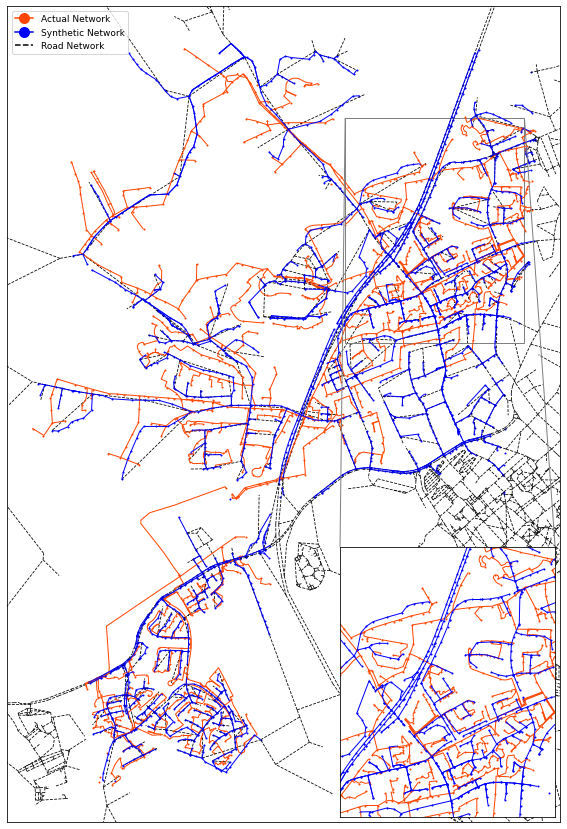
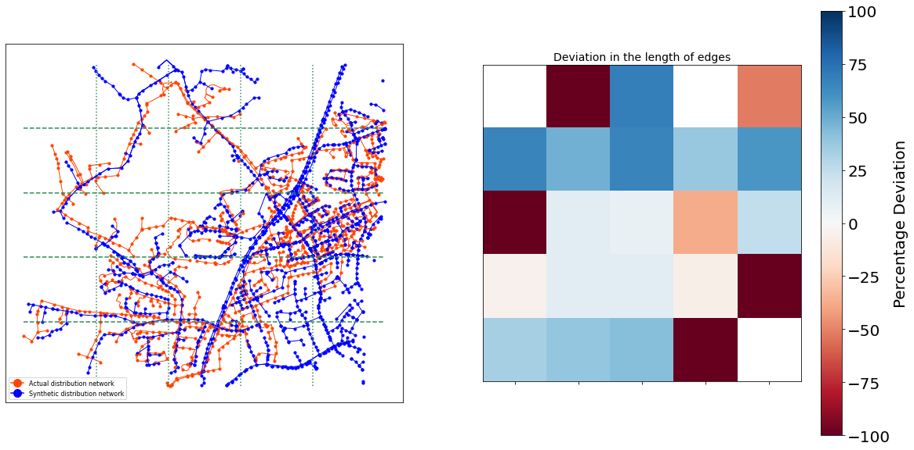
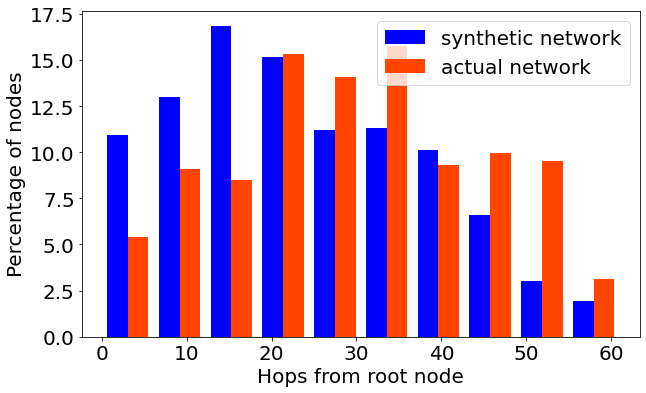
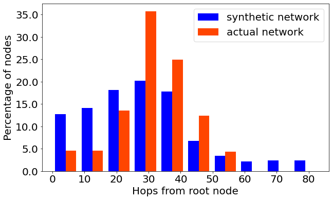
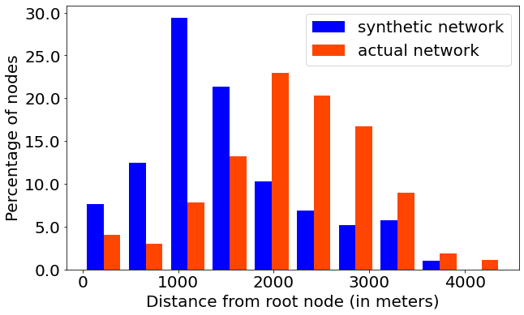
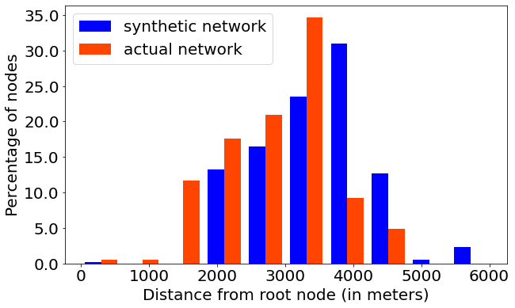

## Operational Validation
In order to validate the generated synthetic networks, we obtained some regional power distribution networks from a distribution company. We compare the voltages at the residences when they are connected to the actual and synthetic network in Fig.~\ref{fig:validate-voltage-flow}. We call this *operational validity*: The basic idea is that if we substitute the actual network with the synthetic network, we should see minimal node voltage differences between the two. Here, the green lines signify $\pm1\%$ deviation from the voltages if the residences had been connected to the actual network. We observe that the residence voltages in the synthetic network remain within this $\pm1\%$ regulation, which validates our generated synthetic network. We also compare the edge flows in the two networks through the histogram in the following figure. Since the networks are radial in structure, the edge flows is proportional to the number of children nodes. The structural differences in the two networks explain the observed deviation in the edge flows of the networks.
 

## Structural Validation
In this section, we perform a visual comparison of the generated synthetic network to the actual network covering the same geographical region. At first sight, the two networks are adjacent to and almost overlap each other. The inset figure confirms this hypothesis. 

## Statistical Validation
In this section, we compare the statistics of the generated network with that of the actual network. We consider a combination of various node and edge statistics for the comparison. They are (i) spatial distribution of nodes, (ii) length of network in miles, (iii) spatial distribution of graphlets/motifs etc. Let the actual and synthetic network for a particular geographical region be denoted by $\mathscr{G}_{act}(\mathscr{V}_{act},\mathscr{E}_{act})$ and $\mathscr{G}_{syn}(\mathscr{V}_{syn},\mathscr{E}_{syn})$ respectively. For each comparison, we divide this geographical area into multiple rectangular grids of equal sizes. We perform the statistical comparison over these rectangular grids, where in we consider the induced subgraph of the networks formed by the nodes lying in the grid. Therefore, for the grid along the $i^{th}$ row and $j^{th}$ column, let $\mathscr{V}^{ij}_{act}\subseteq\mathscr{V}_{act}$ denote the set of nodes in the actual network lying within the grid. Similarly, $\mathscr{V}^{ij}_{syn}\subseteq\mathscr{V}_{syn}$ denotes the set of nodes in the synthetic network contained in the grid. We perform the statistical comparisons of the induced subgraphs $\mathscr{G}^{ij}_{act}(\mathscr{V}^{ij}_{act},\mathscr{E}^{ij}_{act})$ and $\mathscr{G}^{ij}_{syn}(\mathscr{V}^{ij}_{syn},\mathscr{E}^{ij}_{syn})$.\\

#### Spatial distribution of nodes
First, we compare the distribution of nodes in each network. The percentage of the total number of nodes in the network is an indicator of the distribution of nodes. Therefore, we use the following metric to compare the node distribution for the grid along the $i^{th}$ row and $j^{th}$ column.
\begin{equation}
    \mathcal{M}^{(N)}_{ij}=\dfrac{\dfrac{|\mathscr{V}^{ij}_{act}|}{|\mathscr{V}_{act}|}-\dfrac{|\mathscr{V}^{ij}_{syn}|}{|\mathscr{V}_{syn}|}}{\dfrac{|\mathscr{V}^{ij}_{act}|}{|\mathscr{V}_{act}|}}\times 100
\end{equation}
The above metric can be used to denote the percentage deviation in the distribution of nodes in each rectangular grid. The following figure shows two separate grid resolutions and spatial comparison of node distribution for each resolution. The color code denotes the intensity of the percentage deviation in the distribution. Note that for some grids, the actual network data might be missing. In such cases, the comparison is not done and the grid is colored white. We notice that for most of the rectangular grids, the percentage deviation in the node distribution is fairly small. The large deviations observed at the bottom right and top right corners are primarily due to the absence of actual network data for those grids.

 

#### Comparison of network length
We compare the network lengths in miles for each network. The percentage deviation is an indicator of the structural dissimilarities of the networks. Therefore, we use the following metric to compare the lengths of the induced network for the grid along the $i^{th}$ row and $j^{th}$ column.
\begin{equation}
    \mathcal{M}^{(L)}_{ij}=\dfrac{\sum_{e\in\mathscr{E}^{ij}_{act}}l_e-\sum_{e\in\mathscr{E}^{ij}_{syn}}l_e}{\sum_{e\in\mathscr{E}^{ij}_{act}}l_e}\times 100
\end{equation}
where $l_e$ is the length of the edge in miles. The above metric can be used to denote the percentage deviation in the network lengths in each rectangular grid. The following figure shows two separate grid resolutions and spatial comparison of network lengths for each resolution. The color code denotes the intensity of the percentage deviation. Note that for some grids, the actual network data might be missing. In such cases, the comparison is not done and the grid is colored white. The two networks are visually seen to almost overlap each other. Therefore, it is expected that the overall length of the networks would be fairly similar to each other. We observe that for the majority of the rectangular grids, the percentage deviation in the network lengths is fairly small.
 | 

#### Comparison of graphlets/motifs
We consider graphlets/motifs in each network and compare their respective distributions. For example, we consider two graphlets of (i) four node chains and (ii) 7 node star shaped graphlet as shown in the following figure. For each rectangular grid, we compare the distribution of these 4 and 7 node graphlets/motifs and plot the deviation in the spatial distribution.

We use the following expression for computing the percentage deviation.
\begin{equation}
    \mathcal{M}^{(M)}_{ij}=\dfrac{\dfrac{n^{ij}_{act}}{n_{act}}-\dfrac{n^{ij}_{syn}}{n_{syn}}}{\dfrac{n^{ij}_{act}}{n_{act}}}\times 100
\end{equation}
where $n_{act}$ and $n_{syn}$ are the total number of such motifs in the entire actual and synthetic networks respectively. The number of motifs in the grid along the $i^{th}$ row and $j^{th}$ column for either network are denoted by $n_{act}^{ij}$ and $n_{syn}^{ij}$. Note that the 4-node chain motifs are more common in the network than the 7-node star motifs. From the results, it is seen that the considered motifs (4-node chain and 7-node star) are almost equally distributed in the two networks.
 | 
 | 

#### Degree Distribution
We consider three separate sections of the two networks and compare the degree distribution for each section. We observe that the two distributions match each other very closely. We observe that the degree of the nodes ranges between $1$ and $4$ for either networks and the degree distribution shows that majority of nodes have a degree of $2$. This is also confirmed by our results where we compare the distribution of chain motifs in the networks.
 |  | 

#### Hop Distribution
Next, we consider the hop distribution for the networks. This is an important analysis given the forest of tree structure of the networks. In this analysis we study how the nodes in each network are distributed around the root node. First, we compare the number of edges between each node and the root node or feeder node. We observe that the hop distribution almost follows a similar distribution to the edge flows which is shown in the beginning of this section. We have shown earlier that even though the spatial distribution of nodes in the networks are similar, the number of nodes in each network is different. Therefore, we consider the percentage of nodes at each hop rather than the absolute number of nodes for the comparison.
 |  | 

#### Reach Distribution
A better comparison would be the \emph{reach distribution} of each network where we compare how far (in meters) are the nodes in each network located from the root or feeder node. An interesting observation is that the actual network consists a large number of long edges. This is primarily because of the fact that the network has been built over multiple years as the population grew in the geographical location. However, the synthetic networks are generated using first principles and as an output of an optimization problem where the generated network has the minimum length (or requires minimal installation and maintenance cost).
 |  | 
